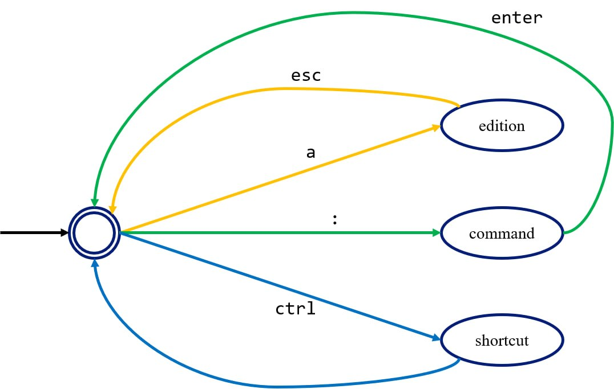

# Verilog to UVMEnv testbench path

This project shows the step-to-step for creating a verification environment using different tools, from typical verilog testbench until using UVMEnv.

Each example us used in one or other way into UVMEnv projects, which can be viewed in its main repo.

## Examples
Testbenches are developed using an ALU model with the next tools:
1. Icarus (Typical simulation).
2. Verilator (Co-simulation).
3. "Veripython" (Use of Verilator + Python for making co-simulation).
4. Cocotb (Coroutine Cosimulation testbench).
5. UVM (Universal Verification Metodology).
6. PyUVM (UVM implementation with Python).
7. UVMEnv (Open-source framework for Python UVM testbenches).

## Related repositories
- [Verilator](https://github.com/verilator/verilator.git)
- [Icarus](https://github.com/steveicarus/iverilog.git)
- [Python](https://github.com/python/cpython.git)
- [Cocotb](https://github.com/cocotb/cocotb.git)
- [PyUVM](https://github.com/pyuvm/pyuvm.git)
- [UVMEnv](https://github.com/ManBenit/uvmenv.git)
- [Cocotb coverage](https://github.com/mciepluc/cocotb-coverage.git)

## Auxiliar commands
Run Iverilog:
```bash
iverilog -o intermedio  ALU_tb.v  $(find ../../models/alu_taller -type f \( -name "*.v" -o -name "*.sv" \))
```

Run Verilator making a runnable testbench file:
```bash
verilator --cc -Wno-WIDTHEXPAND -Wno-fatal --trace --x-assign unique --x-initial unique --hierarchical --exe --build $(find ../../models/alu_taller -type f \( -name "*.v" -o -name "*.sv" \)) ALU_tb.cpp --top-module ALU -o alutb
```

Run Verilator to make a C++ API:
```bash
verilator --cc -Wno-WIDTHEXPAND -Wno-fatal --trace --x-assign unique --x-initial unique --hierarchical --exe --build -CFLAGS "-fPIC" -LDFLAGS "-shared" $(find ../../models/alu_taller -type f \( -name "*.v" -o -name "*.sv" \)) ALU_api.cpp --top-module ALU -o libalu.so
```

## Help with Vim
Very simplified basic help for using Vim editor.

<p align="center">
  
</p>

